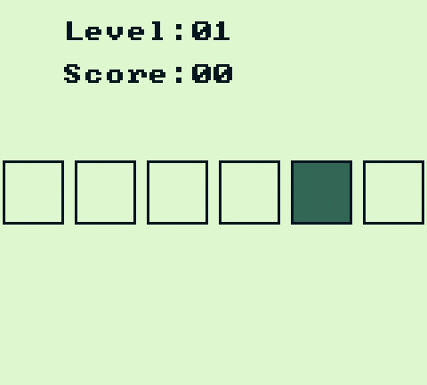

# Metronome - A Game for Nintendo Game Boy #

----------

A ball bounces from side to side, hit it before it leaves the screen to score a point!

## Controls ##

Start Game:&nbsp;**Start**

Left-Hit:&emsp;&emsp;&nbsp;**D-Pad Left**

Right-Hit:&nbsp;&emsp;&ensp;**A**

## Running the Game
The latest version of `metronome.gb` can be found [here](https://github.com/alittlecoyote/metronome-gb/releases/latest).

You will need a Game Boy emulator like [BGB](http://bgb.bircd.org/), [SameBoy](https://sameboy.github.io/) to run the game.

## Build ##
Written to be built with [RGBDS](https://rgbds.gbdev.io/), which must be installed before building.

A build script is included, [src/build.sh](src/build.sh), that will build a `game` directory. The `metronome.gb` file can be found in the `game` directory.

## Developers Notes ##

This game was a project for me to learn some Game Boy ASM development basics, the scope is tiny and the code is likely very poorly optimised.

### Some resources I found useful:

[Game Boy Development Community](https://gbdev.io/) - This is a great collection of documents, tools and community links for Game Boy Development

I highly recommend the [Gingerbread library](https://github.com/ahrnbom/gingerbread) and its associated book, "[Game Boy Assembly Programming for the Modern Game Developer](https://github.com/ahrnbom/gbapfomgd)." 

This Gingerbread library provides some very useful boilerplate code such as defining various constants and low-level functions, takes care of the boot process and the ROM header, and when combined with the tutorials in "Game Boy Assembly Programming for the Modern Game Developer" they made this process much easier than I was expecting.
